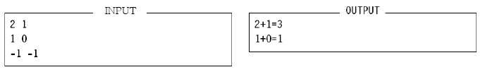

# ACM International Programming Contest / Relax! It’s just a game

**You:** What’s the score? Did I miss much?  
**Me:** It’s 2-1 for **DRAGONS** and the
second half just started. The first half was
quite boring.  
**You:** Who scored first? **DRAGONS** or
**MOGAS 90**?  
**Me:** What difference does it make?  
**You:** Big difference! I can predict the
outcome of the match if I knew the order
of which goals were scored in the first half.  
**Me:** What do you mean?  
**You:** It’s 2-1 for **DRAGONS**, right? One
of three things could have happened:
**DRAGONS** scored two goals then
**MOGAS 90** scored; Or, **DRAGONS**
scored its first goal, then **MOGAS 90**,
then **DRAGONS** again; Or, **MOGAS 90**
scored first, then **DRAGONS** scored its
two goals.  
**Me:** So?!! I still don’t understand what
difference does that make? It’s still 2-1 for
**DRAGONS**! Why don’t you just relax and
let us continue watching the game in
peace.  
**You:** You don’t understand!! I believe the
probability of who’ll win depends on the
order of how goals were scored. Now I
have to predict the outcome for 3
possibilities.  
**Me:** And what if the score was 3-2? What
would you have done then?  
**You:** I would have to work for 5 different
possibilities. No?  
**Me:** Of course not! The number of
possibilities isn’t always equal to the sum.  
**You:** Can you tell me when will it be equal
to the sum?  
**Me:** You’re a programmer, why don’t you
write a program that counts the number of
possibilities and compare it to the sum?  
**You:** I don’t have the time, I want to watch
the match. Besides, I have nine other
problems to worry about.  
**Me:** I’ll give you a hint. The possibilities
will be equal to the sum only if one of the
teams scored a certain number of goals

## Standard input

Your program will be tested on one or more test cases. Each test case specifies two natural
numbers (**A** and **B**) (separated by one or more spaces) representing the score of the first half.
No team will be able to score more than 10 goals. The last line of the input file contains two -
1’s (which is not part of the test cases.)

## Standard output

For each test case where the number of possibilities is equal to the sum, print: **A+B=C** Where
**A** and **B** are as above and **C** is their sum. If the number of possibilities is not equal to the sum,
replace the **’=’** sign with **’!=’** (without the quotes.)

**Sample Input/Output**

 