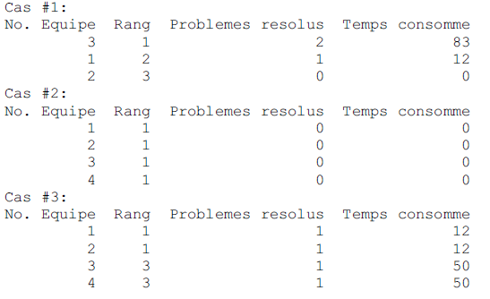

# ACM International Programming Contest / Score

MapCom Technologies organise le Concours National de Programmation du Bénin. A l’issue
de ce concours, les 3 premières équipes seront récompensées. Les meilleures équipes encore
inscrites dans des universités l’année prochaine seront prises en charge pour représenter notre
pays au Concours Régional de Programmation ACM/ICPC sponsorisé par IBM.

Dans le Concours National de Programmation, les solutions soumises aux juges s’appellent des
« runs ». Chaque « run » est soit accepté, soit rejeté par les juges et l’équipe est notifiée du résultat.

Les équipes sont classées suivant le plus grand nombre de problèmes résolus. Pour les besoins
de la cérémonie de remise de prix, les équipes qui résolvent le même nombre de problèmes
sont classées selon le moins de temps total utilisé et pénalisé. Le temps total utilisé et pénalisé
est la somme du temps consommé pour chaque problème résolu. Le temps consommé pour
chaque problème résolu est le temps qui s’écoule depuis le début du concours jusqu’à la
soumission du « run accepté » plus vingt (20) minutes de pénalités pour chaque « run rejeté ».
Il n’y a pas de temps consommé pour un problème non résolu.

Votre programme doit lire une liste de jugements des « runs » et afficher les scores pour les
1ère , 2ème et 3ème équipes.

## Entrée standard

L’entrée peut contenir plusieurs cas d’essais. Chaque cas d’essai est constitué de deux parties.
La première partie est une seule ligne contenant un nombre positif (supérieur ou égal à 3) qui
indique le nombre d’équipes. Les lignes qui suivent sont les jugements des « runs ». Il y a une
ligne par « run », indiquant le temps de soumission (supérieur à 0), le numéro de l’équipe
(compris entre 1 et 99 inclus), le numéro du problème (compris entre 1 et 8 inclus) et le
jugement (oui ou non). La fin du cas est indiquée par un zéro sur une seule ligne.
La dernière ligne de l’entrée contient seulement zéro comme nombre d’équipes. Ce cas ne
doit bien sûr pas être traité. 

## Sortie standard

Pour chaque cas d’essai, vous devez générer le score des trois premières équipes,
conformément au format indiqué dans l’exemple ci-dessous. Le score contient le numéro de
l’équipe, le rang, le nombre de problèmes résolus, le temps total utilisé et pénalisé.

**NB** : Plusieurs équipes peuvent occuper la même place. Par exemple, si plusieurs équipes sont
3ème, affichez les toutes suivant l’ordre croissant des numéros. Si plusieurs équipes sont en
2ème place, elles seront toutes affichées suivant l’ordre croissant des numéros et alors il n’y
aura pas de 3ème équipe à afficher ou à récompenser, etc.

**Sample Input/Output**

**Exemple d'entrée**

```
3
12 1 2 oui
14 3 2 non
25 3 1 oui
29 1 1 non
38 3 2 oui
39 2 1 non
45 1 1 non
0
4
0
5
12 1 2 oui
12 2 1 oui
20 3 4 non
20 4 5 non
30 3 4 oui
30 4 5 oui
0
0
```

**Exemple de sortie**

 

